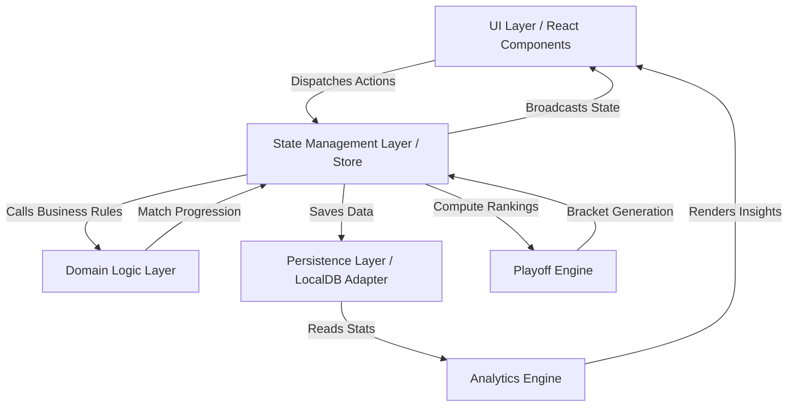
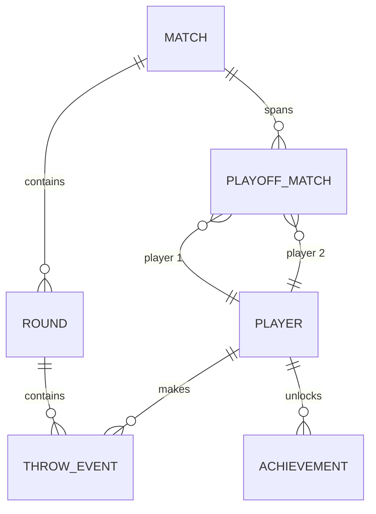
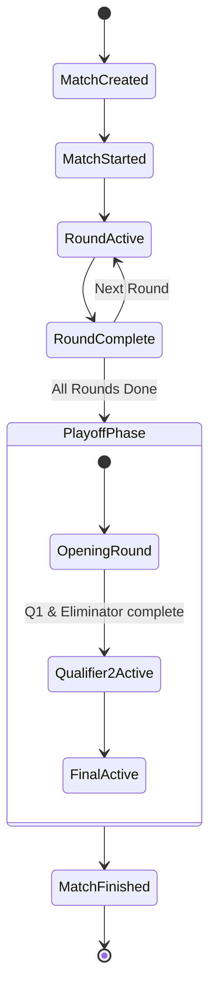
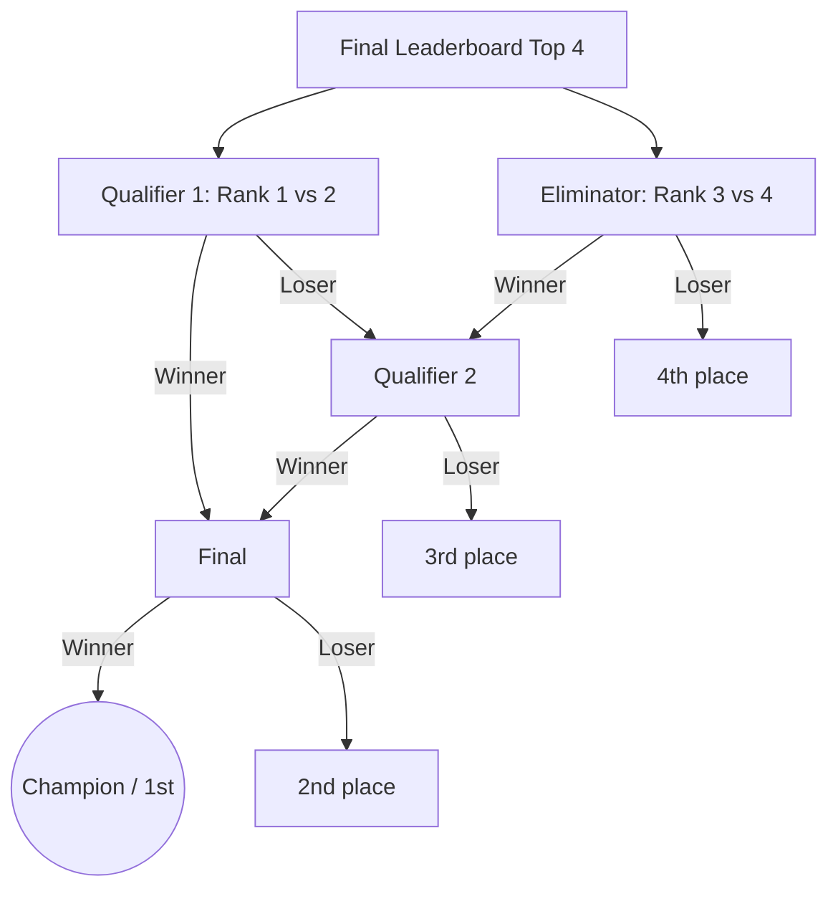
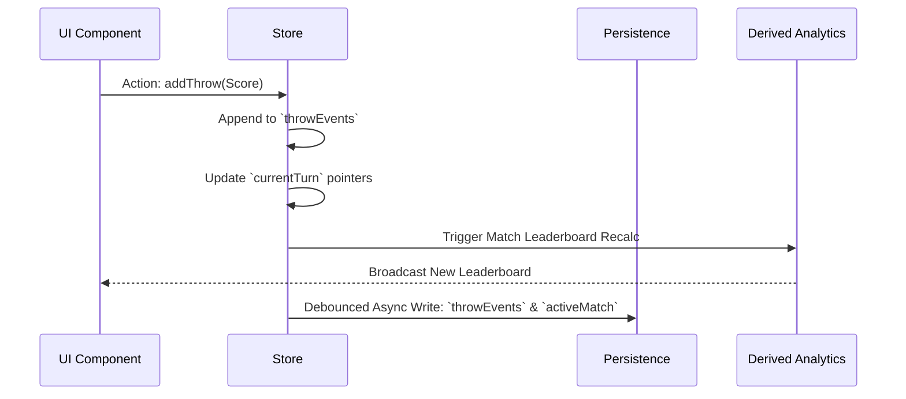
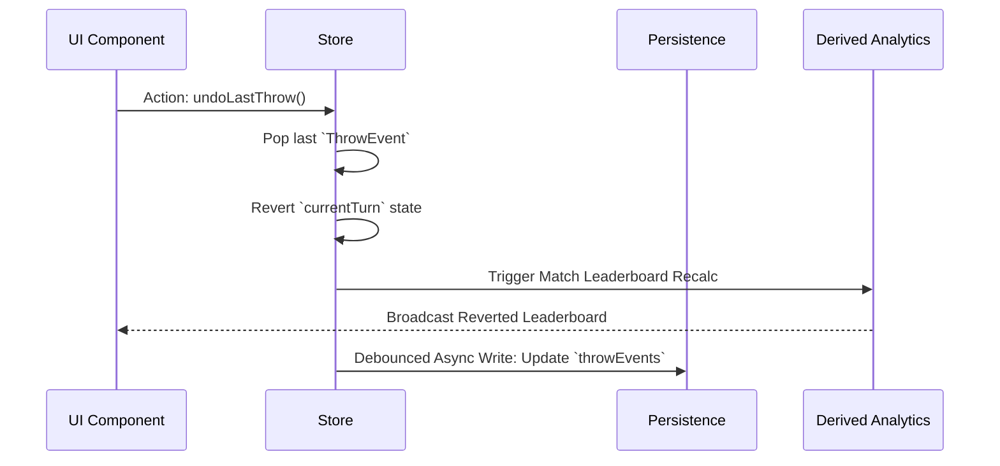
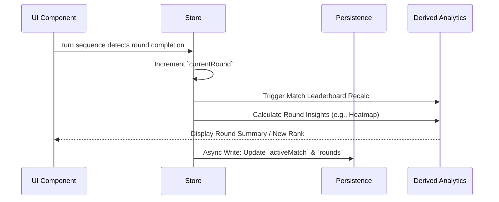
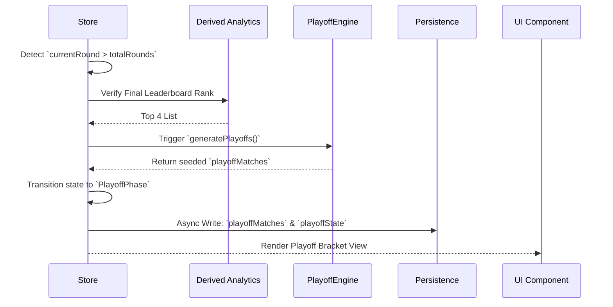
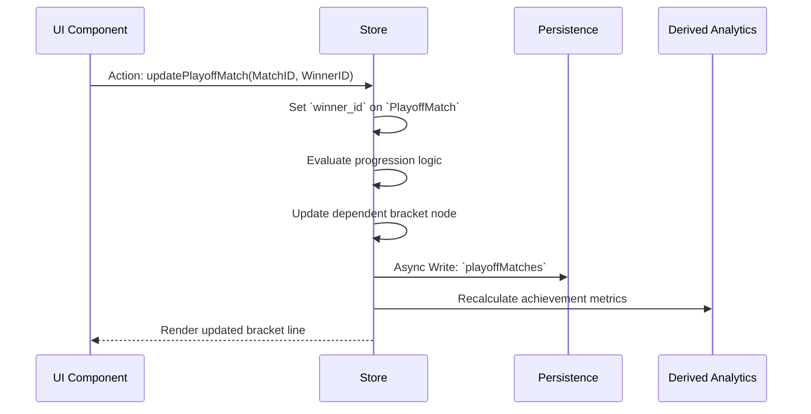

# DartPulse Architecture Document

## 1. Architecture Overview
DartPulse is structured as a **frontend-first application** built on Next.js, allowing rapid MVP deployment without backend dependencies. 

The architecture employs a **modular domain-driven approach**, strictly separating concerns between the UI, domain logic, and persistence layers. This separation ensures that the complex state of a dart match (calculating scores, tracking turns, generating playoffs) is fully decoupled from the React rendering cycle.

By using local browser storage (LocalStorage/IndexedDB) bound to robust typed schemas, the app achieves lightning-fast interactions essential for live scoring. The clean boundary between state management and persistence ensures the system can easily substitute local storage for a cloud backend in the future without rewriting core application logic. This setup perfectly balances the need for a high-performance, polished MVP with scalable long-term growth.

---

## 2. System Architecture
The system consists of several distinct layers:
- **UI Layer:** React components (built with Next.js, Tailwind CSS, and Framer Motion) responsible for rendering the neon-arcade interface and capturing user input.
- **State Management Layer:** In-memory reactive store (e.g., Zustand) that holds the active match state and ensures the UI efficiently updates on state changes.
- **Domain Logic Layer:** Pure functions and services encapsulating the game rules (e.g., tie-breakers, progression logic).
- **Analytics Engine:** A read-only computation layer that processes historical throw data into insights like momentum and consistency.
- **Playoff Engine:** Specialized deterministic logic that dynamically constructs head-to-head brackets from ranking outputs.
- **Persistence Layer:** An abstraction handling the writing and retrieval of raw schema data to local browser storage.

### System Architecture Diagram


---

## 3. Frontend Structure
The Next.js project organization follows a feature-driven module approach. 

### Folder Structure
```text
/
├── app/             # Next.js App Router (Pages & Layouts)
├── components/      # Shared global UI (Buttons, Modals, Glass panels)
├── features/        # Domain-specific modules
│   ├── match-setup/
│   ├── liveMatch/
│   ├── leaderboard/
│   ├── playoffs/
│   ├── analytics/
│   ├── profile/
├── store/           # Global state management (Zustand)
├── hooks/           # Reusable custom React hooks
├── lib/             # Third-party instance wrappers (e.g., Chart libraries)
├── types/           # Global TypeScript definitions
├── utils/           # Pure helper functions (math, formatting)
└── constants/       # Enums, standard scoring arrays, configurations
```
**Purpose of Feature Modules:** Grouping files by domain (e.g., the `liveMatch` folder containing its own sub-components, specific hooks, and logic) prevents the core component folder from bloating and ensures engineering boundaries align with product features.

### Next.js Route Architecture
The application uses the App Router structure. Examples of key routes:
- `/` - The Home page, displaying quick actions and recent match summaries.
- `/match/new` - Match setup screen (adding players, defining rounds).
- `/match/[matchId]` - The live scoring dashboard for an active match.
- `/playoffs/[matchId]` - The interactive playoff bracket view.
- `/leaderboard` - **Global** cross-player leaderboard (completed matches only; final placement + stats); not the per-match live scoreboard.
- `/history` - Paginated list of past matches.
- `/history/[matchId]` - Detailed summary and awards for a completed match.
- `/analytics` - Global and filtered charting dashboard for player performance.
- `/players/[playerId]` - Individual player profile, stats, archetypes, and achievements.

Each route explicitly delegates its complex state rules to the central Store (Zustand), maintaining a clean separation of concerns.

---

## 4. State / Store Design
The frontend state architecture relies on deeply separated state categories to manage the application's complexity:
- **UI state:** Ephemeral local component state managed by `useState` or boolean flags (e.g., modal visibility, active tooltips).
- **Domain state:** The core source of truth for the active session (e.g., match settings, active players, rounds, un-derived throw history).
- **Derived analytics state:** Computed automatically from Domain state via selectors (e.g., live match leaderboard rankings).
- **Persistence state:** Synced data handled asynchronously, pushing the latest Domain state to LocalStorage/IndexedDB.

Global state will be managed centrally using a robust store (e.g., Zustand).

### Proposed Store Schema
```typescript
interface DartPulseStore {
  // Domain State
  activeMatch: {
    matchId: string;
    status: MatchStatus;
    totalRounds: number;
    shotsPerRound: number;
    playoffShotsPerRound?: number;  // optional; defaults to shotsPerRound
    currentRound: number;
  } | null;
  matchPlayers: Player[];
  rounds: Round[];
  
  // High-Volume Event State (one ThrowEvent per shot)
  throwEvents: ThrowEvent[]; 
  
  currentTurn: {
    playerId: string;
    turnIndex: number;
    shotIndexInRound?: number;  // which shot within the current round for this player
  } | null;

  // Computed / Derived State (accessed via selectors)
  matchLeaderboard: LeaderboardEntry[];
  
  // Playoff State
  playoffState: PlayoffStatus;
  playoffMatches: PlayoffMatch[];
  suddenDeathState: SuddenDeathState | null;

  // Global & Analytics
  analyticsFilters: AnalyticsFilters;
  globalPlayerStats: Record<string, PlayerStats>;

  // UI State
  uiFlags: {
    isScoreModalOpen: boolean;
    isUndoConfirmOpen: boolean;
  };
  
  // Actions
  addThrow: (score: number) => void;
  undoLastThrow: () => void;
  advanceRound: () => void;
  generatePlayoffs: () => void;
}
```

- **Base player order:** The Match persists the fixed player order as **basePlayerOrder** (or equivalent). It is set at setup or after shuffle and must not change after the match starts. It is the source of truth for rotating round-start order.
- **Regular match turn order:** Turn order must always be **derived** from persisted data: **basePlayerOrder**, **roundNumber**, and **shotsPerRound** — not from transient UI state. Formula: `startingPlayerIndex = (roundNumber - 1) mod playerCount`; round order = basePlayerOrder rotated by this index. Within a round, each player completes all **shotsPerRound** shots before the next player. **Refresh/recovery** must reconstruct turn position from persisted data (throwEvents, basePlayerOrder, current round); the rotating round-start logic depends on the persisted base order.
- **Undo Handling:** Because `throwEvents` is an append-only timeline (one event per shot), an "undo" operation deletes the most recent event, recalculating derived data implicitly, and rolling back the `currentTurn` pointers.
- **Round Transitions:** Handled deterministically. Each round has **shotsPerRound** shots per player; turn order within the round is the rotated base order, with each player taking all their shots in sequence. When the last player completes their last shot of the round, `currentRound` is incremented.
- **Playoff Transitions:** Triggered automatically when all regular rounds are complete. The Store derives the Final Leaderboard, slicing the top 4 (or top 2 for 3-player), populating `playoffMatches`, and switching `playoffState`. Playoff matches have **one round** with **playoffShotsPerRound** (or **shotsPerRound**) shots per player; sudden death in playoffs uses **1 shot per player** per cycle. Before each playoff match, one player (by decision rights; see PRD) decides who throws first; that choice is persisted as **startingPlayerId** on the PlayoffMatch so recovery is deterministic.
- **Sudden-Death Handling:** Sudden death always uses **exactly 1 shot per tied player** per cycle. Tied players maintain a fixed order during sudden death cycles. If tie-breakers exhaust without resolving rankings at the end of regular rounds, or during a playoff match tie, the store populates `suddenDeathState`. This state suspends normal match progression, triggering a single-shot-per-player interface until the tie is resolved. The tie-break engine must support **shrinking tied subsets**: if a cycle partially resolves a group but leaves some players still tied, sudden death continues for that subset only until ranking is fully resolved. Sudden-death scores are shown in a separate UI area (not mixed into the regular round scoreboard). Final ranking must be fully resolved before winner or playoff progression is computed.

---

## 5. Persistence Model
For the MVP, persistence relies on local browser storage (using IndexedDB for handling potentially large historical event arrays, wrapped by a library like `idb` or `localforage`, or standard LocalStorage if data fits limits).

**Persisted Data:**
- `players`: Global profiles.
- `matches`: Metadata for all historical matches.
- `throws`: The absolute source of truth. All rounds and aggregate scores can be strictly reconstructed by replaying throw events.
- `playoff_results`: Outcomes of head-to-head brackets.

Because the state is highly normalized (Relational via IDs), migrating this layer to a centralized backend simply requires swapping the LocalStorage read/write adapter with an API service wrapper calling a Cloud Database (e.g., PostgreSQL or Supabase) without touching the React components.

---

## 6. Entity Schema
Core domain entities form the backbone of the application.

- **Player:** Central user entity. Fields: `id`, `name`, `avatar`, `created_at`.
- **Match:** Container for a game session. Fields: `id`, `name`, `mode`, `totalRounds`, `shotsPerRound`, optional `playoffShotsPerRound` (defaults to `shotsPerRound` when absent), **basePlayerOrder** (persisted array of playerId defining the fixed order for regular-round rotation; must not change after match start), `status`, `created_at`. Round score is derived from the sum of shot scores in that round; match total is derived from the sum of round scores.
- **Round:** Explicit container tracking a full progression of shots per round. Each round has **shotsPerRound** shots per player. Fields: `id`, `match_id`, `round_number`, `started_at`, `completed_at`. Aggregate state is derived from constituent `ThrowEvent`s (one per shot).
- **ThrowEvent:** One shot (granular scoring action). Fields: `event_id`, `match_id`, `player_id`, `round_number`, `turn_index` (and/or shot index as needed), `score`, `timestamp`. Round score = sum of ThrowEvent scores in that round for that player.
- **PlayoffMatch:** A contextual bracket node. Fields: `id`, `parent_match_id`, `player1_id`, `player2_id`, `stage` (e.g., Qualifier 1), `status`, `winner_id`, `resolved_by` (normal, tie_break, or sudden_death), **startingPlayerId** (who was **actually chosen** to throw first; persisted for deterministic recovery), optional **decidedByPlayerId** (who **had the right** to choose who throws first — traceability only). Optional future-friendly: **seedPlayer1Rank**, **seedPlayer2Rank** (seed ranks from regular leaderboard; for debugging, UI, or analytics; not required for MVP).
- **Achievement:** Badges unlocked globally. Fields: `id`, `player_id`, `type`, `awarded_at`. Achievements are computed aggressively during match resolution and persisted globally; if match history changes, they are incrementally updated.

### Entity Relationship Diagram


---

## 7. Match Event Model
DartPulse uses an **Event-Sourced Scoring Model**: every shot generates one `ThrowEvent`. Round score is the sum of shot scores in that round for that player; match total is the sum of round scores. Regular rounds have **shotsPerRound** shots per player; playoff matches have one round with **playoffShotsPerRound** (or **shotsPerRound**) shots per player; sudden death uses **1 shot per player** per cycle.

### Dart Scoring Model
Allowed throw scores are determined by multiplier and board value: **Single (S)** 1×, **Double (D)** 2×, **Triple (T)** 3×, board values 1–20; **Bull** = 50. Examples: S20 = 20, D20 = 40, T20 = 60. Maximum single throw = 60. Maximum round score = shotsPerRound × 60. Scoring limits are defined in `constants/gameRules.ts` (validation) and `constants/scoringLimits.ts` (analytics/achievements: MAX_SINGLE_SHOT, getMaxRoundScore, BIG_THROW_THRESHOLD).

### Event Structure
```json
{
  "event_id": "evt-1029",
  "match_id": "match-55",
  "player_id": "plr-7",
  "round_number": 3,
  "turn_index": 1,
  "score": 50,
  "timestamp": "2026-03-13T10:00:00Z"
}
```
**Benefits:**
- **Undo:** Automatically drops the latest event and reconstructs the total.
- **Analytics & Replay:** You can traverse timestamps to literally replay the momentum of the entire match, identifying when a comeback occurred.

---

## 8. Match State Machine
A match transitions through deterministic lifecycle states to restrict invalid UI actions (e.g., preventing a score entry before the match formally begins).

### States & Allowed Transitions
- `MatchCreated` → Setup phase.
- `MatchStarted` → Triggers initialization.
- `RoundActive` → Accepts score entries. Transitions to `RoundComplete`.
- `RoundComplete` → Awaits confirmation or rolls automatically to `RoundActive` (new round) or to `PlayoffPhase`.
- `PlayoffPhase` → **Opening round:** Qualifier 1 and Eliminator (3rd vs 4th) in parallel; then **Qualifier 2**; then **Final** (see §9 flowchart).
- `MatchFinished` → Terminated state; triggers history archival.

### State Machine Diagram


---

## 9. Playoff Engine Logic
The Playoff Engine operates only when player count is 4 or more. Progression is **player-count-based**:

- **2 players:** No playoffs, no final. Winner is highest total score after regular rounds (or rank 1 after sudden death if tied).
- **3 players:** No qualifier or eliminator. Top 2 after regular rounds and tie-break go directly to the final.
- **4+ players:** Top 4 after regular rounds and tie-break advance to playoffs. Ranking must be fully resolved (including all sudden-death tie-breaks) before progression is computed.

**Steps (4+ players):**
1. Sort final leaderboard by `total_score` from **regular throws only** (apply Sudden-Death tie-breakers for ordering among tied players; ties must be fully resolved).
2. Slice top 4 players from the array.
3. Bootstrap `PlayoffMatch` rows: **Qualifier 1** (rank 1 vs 2) and **Eliminator** (rank 3 vs 4), playable in parallel.
4. When both Q1 and Eliminator are complete, create **Qualifier 2**: loser(Q1) vs winner(Eliminator). Loser is **4th** place; Q2 loser is **3rd** place.
5. When Q2 completes, create **Final**: winner(Q1) vs winner(Q2). Final loser is **2nd**; final winner is **Champion (1st)**.
6. Active playoff UI follows the current `PlayoffMatch` state from the API (pending/active/completed per stage).

**Playoff undo (server-authoritative):** Bracket safety for playoff undo depends on **downstream throw existence**, not on whether the downstream playoff match row exists. Undo validation must inspect the **downstream dependent** playoff match and its **throw count**: if that match has one or more persisted throws, undo of the prior match is blocked; if it has zero throws (or does not exist), undo is allowed and any invalid downstream match may be reconciled. Downstream match creation or display (e.g. match row exists, bracket shows the match, first-throw choice made) does **not** by itself lock prior matches. The client must not decide bracket safety by itself; the server is the sole authority.

### Playoff Flow Diagram


---

## 10. Scoreboard and Leaderboard Computation
Round scores (sum of shots in that round), total scores (sum of round scores), and the match leaderboard are **derived exclusively from ThrowEvent records** (one event per shot). They are not stored as independent database entities. The selector-driven architecture ensures the live scoreboard and leaderboard are always computed from the same source of truth.

**Shots per round:** Regular rounds use **shotsPerRound** shots per player; playoff matches use **playoffShotsPerRound** (or **shotsPerRound**) in a single round. Sudden death always uses **1 shot per player** per cycle.

**Separation of regular and sudden-death scores:** The **regular** scoreboard (rounds 1 through totalRounds, and regular totalScore) uses **only** ThrowEvents with `eventType === "regular"`. Sudden-death ThrowEvents are used solely to determine **ordering among tied players**; they do not change regular totalScore. In the UI, sudden-death scores must be shown **separately** from the regular round columns. Final ranking is fully resolved (including all tie-break ordering) before winner determination or playoff progression is computed.

### Selector-Driven Scoreboard
The live match UI consumes derived data via selectors. Key selectors include:
- **selectMatchLeaderboard:** Derives rank, playerName, roundScore (sum of shots in current round), and totalScore from **regular** throwEvents grouped by playerId; tie-break ordering uses resolved sudden-death results. Used for the ranked leaderboard list.
- **selectCurrentPlayer:** Resolves the player whose turn it is from currentTurn and matchPlayers.
- **selectCurrentRoundThrows:** Filters throwEvents by the current round for round-specific display (regular rounds only for the main table); each cell/round score = sum of shots in that round.
- **selectRoundScoreTable (or equivalent):** Derives a player-by-round score matrix (players as rows, rounds as columns) from **regular** throwEvents; each cell = sum of that player's shots in that round. Sudden-death scores are displayed in a separate UI section. The UI should show individual shot scores, round total, and match total as required.

UI structure for the live match screen aligns with these selectors:
- **CurrentPlayerPanel:** Displays the current player (from selectCurrentPlayer) and optional round label.
- **ScoreTable:** Renders players as rows and rounds as columns; cell values come from the derived round-by-round scores; total column emphasized.
- **ScoreTableRow:** A single player row; highlighted when that player is the current player; round cells and total cell populated from selector output.

### Match Outcome Summary (Completed Match UI)
When the regular match is completed (`match.status === "matchFinished"`), the UI must show a **Match Outcome Summary** before the user navigates to playoffs or the final. This summary is **derived from the final resolved regular-match ranking**, not from raw totals.

**Derivation source (conceptual chain):** The same pipeline used for playoff creation must be used for the Match Outcome Summary display:
1. **Sudden-death resolution** — Resolved tie orders from sudden-death throw events (when applicable).
2. **Final resolved ranking** — Leaderboard with ties broken by the resolved orders.
3. **Progression derivation** — Winner, top-two, or top-four (and thus qualification and pairings) from that leaderboard.

**Equivalent conceptual chain:** `deriveSuddenDeath` → `deriveLeaderboardFromThrowEvents` → `deriveMatchOutcome`.

**Requirements:**
- The UI must **not** compute ranking independently from raw totals. Qualification and pairing display must use the **same final resolved ranking source** as playoff creation (e.g. the same `resolvedTieOrders` and leaderboard derivation). This ensures the Match Outcome Summary and the actual playoff bracket never diverge (e.g. after sudden death resolving rank 1 and 2).

### Match Leaderboard
The Match Leaderboard re-computes explicitly after each shot (ThrowEvent) to provide real-time updates. The algorithm is:
1. Group `ThrowEvent`s by player within the active match (regular events only).
2. Calculate `round_score` for the current round for each player = **sum of that player's shot scores in that round** (shotsPerRound shots).
3. Calculate `total_score` for the match = sum of round scores.
4. Sort players by `total_score` descending (total_score from regular throws only).
5. Apply tie-breakers sequentially if scores are tied:
   - Highest single throw in the match.
   - Highest number of bullseyes.
   - Highest score in the final round.
6. If still tied, the match suspends into sudden death: **1 shot per tied player** per cycle. Tie-break logic must support shrinking tied subsets: if a cycle leaves some players still tied, sudden death continues for that subset until ranking is resolved.

### Global Leaderboard
The Global Leaderboard is compiled asynchronously to power aggregate long-term analytics. Recalculation is triggered during `MatchFinished`. The algorithm is:
1. Aggregate completed matches from persistence.
2. Calculate `matches_played` across the dataset.
3. Calculate total `wins`.
4. Calculate `average_round_score` across all historical rounds.
5. Determine all-time `best_throw`.
6. Count earned `achievements`.

---

## 11. Analytics Computation Model
Insights are generated using historical `ThrowEvent` and `Round` data. Analytics are broadly computed during match completion, while specific heavy visualizations execute during analytics page rendering.

### Core Metrics
- **`average_round_score`**: 
  - **Inputs:** `total_score`, `total_rounds`. 
  - **Concept:** `sum(all valid throw scores) / total_rounds`. 
  - **Output:** Float value.
- **`average_throw_score`**: 
  - **Inputs:** `total_score`, `throw_count`. 
  - **Concept:** `sum(all valid throw scores) / count(Throws)`. 
  - **Output:** Float value.
- **`best_throw`**: 
  - **Inputs:** `throwEvents`. 
  - **Concept:** `Math.max(...throw.score)`. 
  - **Output:** Integer.

### Story & Performance Metrics
- **`momentum_timeline`**: 
  - **Inputs:** `throwEvents`, `rounds`. 
  - **Concept:** Replays the match incrementally, saving the active leaderboard rank at the boundary of each round. 
  - **Output:** Array of round-stage rankings per player suitable for a line chart.
- **`comeback_detection`**: 
  - **Inputs:** `momentum_timeline`. 
  - **Concept:** Flags true if user X drops to bottom 50% by mid-match but achieves Rank 1 by Final. 
  - **Output:** Boolean / Highlighted text.
- **`clutch_performance`**: 
  - **Inputs:** `throwEvents` arrays grouped by round. 
  - **Concept:** Compares player's `average_round_score` in the final two rounds versus earlier rounds. 
  - **Output:** Percentage differential.
- **`round_heatmap`**: 
  - **Inputs:** `throwEvents` grouped by Player ID and Round Number. 
  - **Concept:** Normalizes intensities based on the highest scored round in the match. 
  - **Output:** 2D grid matrix of intensity scores (0.0 to 1.0).
- **`match_energy_meter`**: 
  - **Inputs:** `momentum_timeline`, overall score variance. 
  - **Concept:** Calculates high variance and sums frequency of rank lead changes. 
  - **Output:** Arbitrary "Energy" index out of 100.

### Streaks & Profiles
- **`win_streak`**: 
  - **Inputs:** Historical Match Winners array. 
  - **Concept:** Counts consecutive appearances of Player ID as Match Winner across all time. 
  - **Output:** Integer.
- **`bullseye_streak`**: 
  - **Inputs:** Sequential `throwEvents`. 
  - **Concept:** Counts consecutive throws equal to 50 points. 
  - **Output:** Integer.
- **`player_archetypes`**: 
  - **Inputs:** `throw_variance`, `best_throw`, `clutch_performance`. 
  - **Concept:** Evaluates logical rules (e.g., low variance -> "Consistent Player"; high variance + high clutch -> "Clutch Player"). 
  - **Output:** String label.
- **`achievements`**: 
  - **Inputs:** Match context outputs. 
  - **Concept:** Evaluates threshold unlocks (e.g., hitting high win streak unlocks Badge). 
  - **Output:** Append object to `Achievement` array.

---

## 12. UI Action → State → Persistence Flow
This demonstrates the robust unidirectional data flow for key application actions.

### 12.1 Enter Score


### 12.2 Undo Throw


### 12.3 Finish Round


### 12.4 Start Playoffs


### 12.5 Update Playoff Match


---

## 13. Error Handling and Recovery
- **Incorrect Score Entry:** Fixed instantly via the "Undo" action, popping the last standard `ThrowEvent` from memory. 
- **Editing Past Round Scores:** Triggers an `UpdateHistoricalThrow` action which splices the exact event and forces a deep recalculation across the store. Ensure that if historical throws are edited *after* playoffs have been generated, the Playoff results and seedings must be either recomputed automatically or invalidated visually, pausing the game until the bracket conflict resolves.
- **Debounced Persistence Writes & Autosave:** The Store hooks into a debouncer to batch persistence writes globally (e.g., waiting 500ms after the last fast score entry) to prevent thrashing IndexedDB, ensuring the "Autosave" behavior remains completely invisible and performant.
- **Match Resume Logic:** Because every `ThrowEvent` triggers autosave persistence, closing the browser halfway through a match is fully recoverable. On Home page load, if `activeMatch != null` is found locally, the application redirects the user directly to the Match dashboard or prompts "Resume Match".
- **Corrupted Local Storage:** Wrap all load schema extractions in Zod validation. If corrupted arrays are found, the application purges the specific corrupt node or offers the user a localized fallback to the previous cleanly verifiable state block without crashing the React root.

---

## 14. Extensibility Considerations
- **Backend APIs & Cloud Sync:** The `Persistence` layer interface can be swapped from IndexedDB to REST/GraphQL clients using React Query without changing a single line of state or UI code.
- **Authentication:** Global profiles in MVP easily upgrade to OAuth accounts.
- **Real-Time Multiplayer:** The Event-Based model is perfectly designed for WebSockets. A throw locally generates an event, dispatches optimistic UI updates, and pushes to a socket.
- **Mobile/PWA Support:** Next.js allows an immediate PWA deployment using manifest plugins. The strict separation of UI components makes migrating the logic into React Native structurally trivial.
