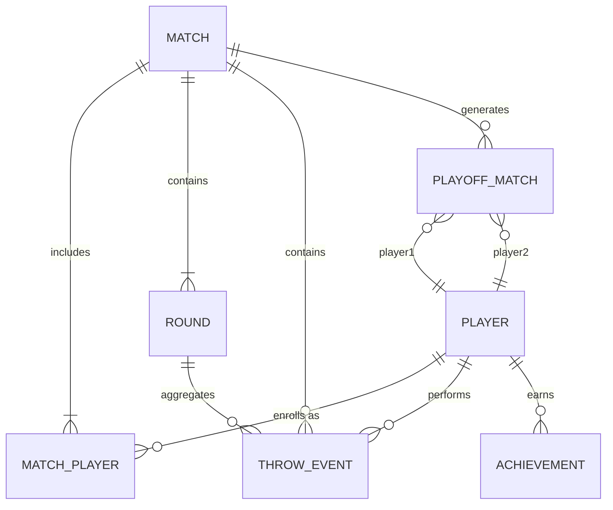

# Entity Model: DartPulse

## 1. Purpose of This Document
This document defines the core data entities of DartPulse and acts as the strict source of truth for:
- Prisma schema design.
- TypeScript domain types mapping.
- Repository interface structures.
- API payload shapes expected by the client.
- Analytics computation inputs.

This document focuses entirely on **domain entities** representing backend persistent data and computational state, not UI components.

---

## 2. Modeling Principles
The data model across DartPulse follows these global principles:
- **camelCase naming:** `camelCase` must be used for all fields universally.
- **MongoDB storage:** All persistent entities will be stored in a NoSQL MongoDB instance, mediated by Prisma.
- **Immutability of Match History:** Active match states may be appended or edited (e.g., undo), but completed matches become inherently immutable.
- **Derived Analytics:** Analytics are strictly computed derived states fetched from persisted match data, not precomputed or statically maintained redundant fields.
- **No snake_case:** `snake_case` is fundamentally banned across all models and payloads.
- **ID consistency:** Identifier fields must be consistent across the DB arrays, API DTOs, and TypeScript instances. Prisma models and frontend interfaces should align closely.

---

## 3. Core Entities Overview
The primary persistent entities in the system include:
- `Player`
- `Match`
- `MatchPlayer`
- `Round`
- `ThrowEvent`
- `PlayoffMatch`
- `Achievement`

**Derived / Non-Persistent Concepts:**
- `matchLeaderboardEntry`
- `globalLeaderboardEntry`
- `analyticsSnapshot`
- `suddenDeathState`

The derived entities exist in TypeScript and Zustand memory but generally do not possess their own dedicated MongoDB collections unless aggressive caching is later enabled.

---

## 4. Entity Definitions
The following definitions map exactly how the database should handle bounded context domains.

---

## 5. Player Entity
**Purpose:** Represents a persistent game participant.

**Type:** Persistent.

**Key Fields:**
- `playerId` (Primary Key)
- `name`
- `avatarColor`
- `createdAt`
- `updatedAt`

**Optional future-friendly fields:**
- `avatarUrl`
- `status`

**Relationships:**
- Participates in many matches (via `MatchPlayer`).
- Can have many achievements.
- Contributes many `throwEvents`.

**Lifecycle:**
- Created before or during the match setup configurations.
- Persists independently across all matches.

**Implementation note:**
A `Player` is not a securely authenticated user account in the MVP; it acts as a lightweight tracking alias mapped locally.

---

## 6. Match Entity
**Purpose:** Represents a single darts session from initial setup to final resolution completion.

**Type:** Persistent.

**Key Fields:**
- `matchId` (Primary Key)
- `name`
- `mode`
- `totalRounds`
- `shotsPerRound` — number of shots each player takes per round in the regular match
- `playoffShotsPerRound` (Optional) — shots per player in the single round of each playoff match; if not specified, defaults to `shotsPerRound`
- `basePlayerOrder` — array of `playerId` in the fixed order used for regular-round rotation (e.g. `string[]`). Set at setup or after shuffle and **must not change after the match starts**. This is the source of truth for rotating round-start order and must be used for refresh/recovery and deterministic turn derivation.
- `status`
- `createdAt`
- `startedAt`
- `completedAt` (Nullable)

**Backward compatibility:** Matches without `shotsPerRound` or `playoffShotsPerRound` should be treated as `shotsPerRound = 1` and `playoffShotsPerRound = shotsPerRound`. Matches without `basePlayerOrder` may derive it from matchPlayers order (creation order) for legacy data.

**Possible status values:**
- `matchCreated`
- `matchStarted`
- `playoffPhase`
- `matchFinished`

**Detailed playoff sub-states:**
- `qualifier1Active`
- `qualifier2Active`
- `eliminatorActive`
- `finalActive`

**Relationships:**
- Has many rounds.
- Has many throw events.
- Has many participating players (via `MatchPlayer`).
- Has many playoff matches.

**Lifecycle:**
- Freely mutable while in active session.
- Locked and strictly immutable once the status reaches `matchFinished`.

**Base order:** The Match persists the fixed player order as **basePlayerOrder** (or equivalent clearly named field). This represents the order after setup/shuffle and before match start; it is the source of truth for rotating round-start order, must not change after the match starts, and must be used for refresh/recovery and deterministic turn derivation.

**Implementation note:**
The `Match` is the root aggregate of gameplay. Most queries filter down implicitly from a `matchId`.
For MVP, `Match.status` may store the full current state, including detailed playoff states, for simpler implementation.

---

## 7. MatchPlayer Entity
**Purpose:** Represents the participation instance of a specific player within a specific match.

**Type:** Persistent (Pivot/Join Table Equivalent).

**Key Fields:**
- `matchPlayerId` (Primary Key)
- `matchId`
- `playerId`
- `seedRank` (Nullable until regular rounds finish)
- `finalRank` (Nullable)
- `isQualifiedForPlayoffs` (Boolean)
- `createdAt`

**Why this entity is useful:**
- It decisively separates persistent player global identity from individual match participation mapping.
- Provides a scalable anchor to store match-specific state like conditional rankings, tournament seeding, and playoff qualification limits without polluting the pure `Player` object.

**Relationships:**
- Belongs to one match.
- References one player.

---

## 8. Round Entity
**Purpose:** Represents exactly one round in a match. In the regular match, each round has **shotsPerRound** shots per player; round score is derived from the sum of those shot scores.

**Type:** Persistent.

**Key Fields:**
- `roundId` (Primary Key)
- `matchId`
- `roundNumber`
- `startedAt`
- `completedAt`

**Relationships:**
- Belongs to one match.
- Has many `throwEvents` (one per shot).

**Participation Rule:**
- Each MatchPlayer takes **shotsPerRound** shots per round (configurable on the Match). Turn order within a round: one player completes all their shots, then the next player.
- A Round is considered complete when all participating MatchPlayers have recorded all **shotsPerRound** shots for that round.
- Round score is **derived** from the sum of ThrowEvent scores in that round for each player; it is not stored as a separate field.

**Implementation note:**
Round data is derived from `ThrowEvents`; the `Round` entity may remain for analytics and progression tracking. Playoff matches have a single round per PlayoffMatch, with **playoffShotsPerRound** (or **shotsPerRound**) shots per player.

---

## 9. ThrowEvent Entity
**Purpose:** Represents **one shot** (one singular scoring action) completed by one player in one round. Round score and match total are derived from the sum of ThrowEvent scores; they are not stored independently.

**Type:** Persistent.

**Key Fields:**
- `throwEventId` (Primary Key)
- `matchId`
- `roundId`
- `roundNumber`
- `playerId`
- `turnIndex` (and/or shot index within the round, as needed for ordering)
- `score`
- `isBullseye`
- `eventType`
- `createdAt`

**Explanation of fields:**
- `roundId` is the relational reference to the Round entity.
- `roundNumber` is a denormalized convenience field used for easier sorting, querying, and analytics computation.
- Each ThrowEvent = one shot. Regular rounds have **shotsPerRound** shots per player; playoff matches have one round with **playoffShotsPerRound** shots per player; sudden death has 1 shot per player per cycle.

**Possible eventType values:**
- `regular`
- `suddenDeath`

**Relationships:**
- Belongs to one match.
- Belongs to one round.
- Belongs to one player.

**Implementation notes:**
- This acts as the core event-sourced chronological record driving DartPulse.
- It directly powers the Undo functionality, advanced analytics mapping, and match replay possibilities.
- The `score` mapping natively follows the MVP structure.
- Hardcoded rule: `bullseye = 50`.

**Validation Notes:**
- Throw score validation uses the dart scoring model: integer 1–60 (single/double/triple 1–20, bull 50). Constants: `constants/gameRules.ts` (DART_SCORE_MIN, DART_SCORE_MAX). Analytics and achievements use `constants/scoringLimits.ts` (MAX_SINGLE_SHOT, getMaxRoundScore, BIG_THROW_THRESHOLD).

**Undo Strategy for MVP:**
- Undo removes the most recent ThrowEvent for the active match session.
- The system does NOT use append-only undo markers in the MVP.
- ThrowEvent remains the primary scoring record, but undo is implemented as controlled deletion of the most recent valid event during active gameplay only.
- Completed matches remain immutable, so undo is not allowed after match completion.

---

## 10. PlayoffMatch Entity
**Purpose:** Represents one internal head-to-head playoff stage bracket.

**Type:** Persistent.

**Key Fields:**
- `playoffMatchId` (Primary Key)
- `parentMatchId`
- `stage`
- `player1Id`
- `player2Id`
- `player1Score`
- `player2Score`
- `winnerId` (Nullable)
- `loserId` (Nullable)
- `status`
- `resolvedBy`
- `startingPlayerId` — the player **actually chosen** to throw first in this playoff match (persisted so recovery is deterministic)
- `decidedByPlayerId` (Optional) — the player who **had the right** to choose who throws first (traceability: who made the decision; for display or audit). Distinct from `startingPlayerId`: one had the right, the other is the chosen starting thrower.
- `createdAt`
- `completedAt`

**Optional / future-friendly metadata (not required for MVP correctness):**
- `seedPlayer1Rank` (Optional) — seed rank (1–4) of player1 from the regular-match leaderboard; useful for debugging, UI explanation, or analytics later.
- `seedPlayer2Rank` (Optional) — seed rank of player2. Lightweight documentation only; implement when needed.

**Possible stage values:**
- `qualifier1`
- `qualifier2`
- `eliminator`
- `final`

**Four-player bracket semantics (names are historical; order is Q1 → Eliminator → Q2 → Final):**
- `qualifier1` — 1st vs 2nd seed (parallel with eliminator).
- `eliminator` — 3rd vs 4th seed (parallel with Q1).
- `qualifier2` — loser(Q1) vs winner(eliminator).
- `final` — winner(Q1) vs winner(qualifier2).

**Possible status values:**
- `pending`
- `active`
- `completed`

**Possible resolvedBy values:**
- `normal`
- `tieBreak`
- `suddenDeath`

**Relationships:**
- Belongs inherently to one parent `Match`.
- References two starting players.
- References explicit `winnerId` and `loserId` references once resolved successfully.

**Score Fields:**
`player1Score` and `player2Score` represent the final playoff result for display, history, and analytics purposes.

**Playoff round structure:** Each playoff match has **one round**. Each player takes **playoffShotsPerRound** shots (or **shotsPerRound** from the parent match if not specified). If the round ends in a tie, playoff sudden death begins with **1 shot per player** per cycle until resolved. Before the match, one player (by decision rights; see PRD) chooses who throws first. **startingPlayerId** stores who was **actually chosen** to throw first; **decidedByPlayerId** (optional) stores who **had the right** to choose. This ensures turn order is deterministic after refresh or reconnection.

**Implementation note:**
This entity only materializes and consumes DB scope if playoffs are deliberately triggered.

---

## 11. Achievement Entity
**Purpose:** Represents a badge, statistical milestone, or award earned persistently by a player.

**Type:** Persistent.

**Key Fields:**
- `achievementId` (Primary Key)
- `playerId`
- `type`
- `sourceMatchId` (Nullable mapping context)
- `awardedAt`

**Example type values:**
- `bullseyeKing`
- `longestStreak`
- `clutchPerformer`
- `consistencyMaster`
- `comebackPlayer`

**Relationships:**
- Belongs strictly to one player.
- May loosely reference the specific match ID context where the achievement was triggered.

**Duplication & Persistence Semantics:**
- Achievements are persisted as per-match awards.
- The same player may receive the same achievement type across multiple matches.
- `sourceMatchId` records where the achievement was earned.
- Achievement records are immutable once awarded for a completed match.

**Implementation note:**
Achievements are exclusively computed at the completion bounds of a match and appended later; active matches do not render active badges midway.

---

## 12. Derived / Non-Persistent Models
These derived entities represent transient or composite state, typically generated by repositories or inside Zustand.

### `matchLeaderboardEntry`
Tracks snapshot state relative to an active internal session ranking.
- `playerId`
- `playerName`
- `roundScore`
- `totalScore`
- `rank`

### `globalLeaderboardEntry`
Global aggregates used across main application routing.
- `playerId`
- `playerName`
- `matchesPlayed`
- `wins`
- `averageRoundScore`
- `bestThrow`
- `achievementsCount`

### `analyticsSnapshot`
Advanced historical groupings calculated on demand entirely within Next.js API bounds (not persisted by default in MVP).
- `averageRoundScore`
- `averageThrowScore`
- `bestThrow`
- `momentumSeries`
- `clutchPerformance`
- `winStreak`
- `bullseyeStreak`

### `suddenDeathState`
Active gameplay memory controlling tie-breaker interactions seamlessly. 
- `matchId`
- `tiedPlayerIds`
- `stage`
- `roundNumber`
- `isResolved`

Sudden-death ThrowEvent records are visible in a separate derived UI section (live match UI); they are not mixed into the regular round scoreboard. Regular ranking totals remain based on regular throws only; sudden death determines tie ordering among tied players only.

All entities in this section exist at execution runtime rather than being aggressively materialized into duplicate MongoDB tracking collections.

---

## 13. Relationships Between Entities
The entity associations strictly follow top-down dependency arcs originating from Matches and Players.

**Structure:**
- One `Match` has many `Rounds`.
- One `Match` has many `ThrowEvents`.
- One `Match` has many `MatchPlayers`.
- One `Match` may have many `PlayoffMatches`.
- One `Player` may map to many `MatchPlayers`.
- One `Player` may generate many `ThrowEvents`.
- One `Player` may earn many `Achievements`.

### Graph Structure

---

## 14. Entity Lifecycle Rules
- **Player:** Independent. Outlives and exists prior to matches.
- **Match:** Mutable configuration until finalization event commits.
- **Completed Match:** A hard lock is placed stopping subsequent DB updates immediately.
- **Round:** Instantiated sequentially inside a Match array, resolved actively linearly relative to player sizes.
- **ThrowEvent:** An append-only historical log array, but subject to controlled deletion of the most recent event during active gameplay for the MVP Undo implementation.
- **PlayoffMatch:** Seeded completely only moving into memory post Match configuration threshold mapping.
- **Achievement:** Instantiated only upon Match conclusion scans and assigned out-of-bounds to the active process.

---

## 15. ID and Timestamp Conventions
- **IDs**: All entity IDs exposed in TypeScript types, Prisma models, and API payloads must use camelCase names such as: `playerId`, `matchId`, `matchPlayerId`, `roundId`, `throwEventId`, `playoffMatchId`, `achievementId`. If MongoDB internal `_id` fields are used through Prisma, they must be abstracted away behind these camelCase fields. API consumers and frontend code must never depend on raw Mongo `_id` naming.
- **Timestamps**: All mapped database dates natively translate across properties exactly as `createdAt`, `updatedAt`, `completedAt`.
- **Timezone**: Absolute commitment to standard UTC handling to prevent localization tracking issues spanning global clients.
- Schema matching dictates API models strictly serialize `Date` artifacts as ISO-standard ISO8601 strings to frontend implementations.

---

## 16. Prisma Modeling Guidance
When writing `/prisma/schema.prisma`:
- MongoDB relies heavily on `@db.ObjectId` mappings wrapped structurally behind clean `@id` definitions mapped back to readable `camelCase` entity string hashes (e.g. `playerId String @id @default(auto()) @map("_id") @db.ObjectId`).
- Favor traditional normalized relational foreign keys mapped strictly across the models even utilizing a NoSQL document datastore to aggressively safeguard domain rigidity.
- Prisma abstraction logic absolutely must be suppressed beneath bounded class definitions existing exactly inside `lib/repositories/`, entirely protecting the Next APIs directly.

---

## 17. API Payload Guidance
API endpoints are not allowed to blindly return Prisma outputs.
- Data sent to the boundary relies strictly on `camelCase`.
- DTO (Data Transfer Objects) derived explicitly inside the Repository intercept raw output logic, entirely stripping unneeded internal DB indexing fields.
- The UI layer strictly imports and expects structured validated responses bounding arrays instead of hoping underlying DB documents directly align cleanly.

---

## 18. Open Questions / Future Extensions
These architectural extensions indicate forward-planning structure but strictly do not influence the current MVP scopes:
- Aggressive data caching vs computation latency trade-offs on global aggregated queries.
- Shifting lightweight `Player` identities seamlessly into full JWT/Auth0 authenticated `Users`.
- Replacing explicit standard rule scoring structures iteratively over highly dynamic variable arrays mapping novel gamified scenarios (Cricket, 301).
- Pushing server event tracking directly onto client Websockets allowing seamless cross-client spectators.
